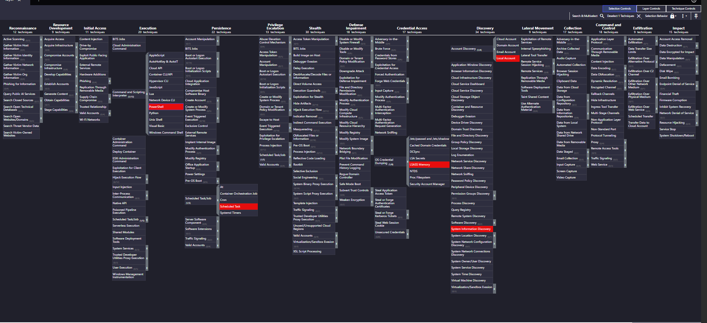

# SOC Monitoring and Threat Detection Using Wazuh

## Overview
A fully functional home SOC lab built to
simulate real-world MITRE ATT&CK techniques,
evaluate Wazuh SIEM detection capabilities,
identify detection gaps, and develop custom
detection engineering solutions.

This project goes beyond basic SIEM setup —
it simulates real attacks, identifies what
default rules miss, and engineers custom
detections to close those gaps.

---

## Lab Architecture

Windows 11 (NITHIN) Ubuntu Server

───────────────── ──────────────

Sysmon → Wazuh Manager

Wazuh Agent Wazuh Indexer

Atomic Red Team Wazuh Dashboard

Attack Simulation 192.168.56.101

Network: VirtualBox Host-Only (192.168.56.0/24)

---

## Technologies Used

| Tool | Purpose |
|------|---------|
| Wazuh 4.7 | SIEM + Alert Management |
| Ubuntu 22.04 | Wazuh Server OS |
| Windows 11 | Monitored Endpoint |
| Sysmon | Deep Windows Event Logging |
| Atomic Red Team | Attack Simulation |
| MITRE ATT&CK | Threat Framework |
| OpenSearch | Log Indexing |
| VirtualBox | Virtualization |

---

## Project Objectives

- Deploy production-grade Wazuh SIEM
- Simulate real MITRE ATT&CK techniques
- Identify detection gaps in default rules
- Engineer custom detection rules
- Document complete IR playbook
- Map all detections to MITRE ATT&CK
- Perform CIS compliance assessment

---

## Attack Simulation Results

### Attacks Simulated Using Atomic Red Team

| # | Technique | MITRE ID | Tactic | Detected | Level |
|---|-----------|----------|--------|----------|-------|
| 1 | PowerShell Execution | T1059.001 | Execution | ✅ YES | 12 |
| 2 | Credential Dumping | T1003.001 | Credential Access | ✅ YES | 15 |
| 3 | Scheduled Task | T1053.005 | Persistence | ✅ YES | 10 |
| 4 | Account Discovery | T1087.001 | Discovery | ✅ YES | 8 |
| 5 | System Discovery | T1082 | Discovery | ✅ YES | 4 |

**Detection Rate: 5/5 = 100%**

### Attack Chain Observed

T1082 (Recon)
↓
T1087 (Account Discovery)
↓
T1059 (Execution)
↓
T1003 (Credential Dumping)
↓
T1053 (Persistence)

This matches real APT attack patterns
documented in MITRE ATT&CK framework.

---

## Custom Detection Engineering

### Detection Gaps Found
Default Wazuh rules missed:
- LSASS direct memory access
- Encoded PowerShell (-enc flag)
- Mimikatz keywords in commandline

### Custom Rules Written

| Rule ID | Severity | MITRE ID | Technique | Status |
|---------|----------|----------|-----------|--------|
| 100001 | CRITICAL (15) | T1003.001 | LSASS Access | Deployed |
| 100002 | HIGH (12) | T1003.001 | Mimikatz Detection | Deployed |
| 100003 | HIGH (12) | T1059.001 | Encoded PowerShell | ✅ FIRED |
| 100004 | MEDIUM (10) | T1053.005 | Scheduled Task | Deployed |
| 100005 | MEDIUM (8) | T1087.001 | Account Enumeration | Deployed |

### Rule 100003 Result

rule.id: 100003
rule.description: CUSTOM RULE: Encoded
PowerShell execution
detected (T1059.001)
rule.firedtimes: 3
rule.level: 12
rule.mitre.id: T1059.001
rule.mitre.tactic: Execution
timestamp: Jul 25, 2026 @ 11:50:33

Custom rule successfully detected encoded
PowerShell execution in real time — 3 alerts
fired within 3 seconds of attack simulation.

---

## MITRE ATT&CK Coverage

| Tactic | Technique | ID | Detected |
|--------|-----------|-----|---------|
| Execution | PowerShell | T1059.001 | ✅ |
| Credential Access | LSASS Memory | T1003.001 | ✅ |
| Persistence | Scheduled Task | T1053.005 | ✅ |
| Discovery | Account Discovery | T1087.001 | ✅ |
| Discovery | System Info | T1082 | ✅ |

---

## Security Use Cases

### 1. Real-Time Attack Detection
Simulated Mimikatz credential dumping
detected at CRITICAL level (15) within
seconds of execution attempt.

### 2. Custom Detection Engineering
Identified encoded PowerShell gap in
default ruleset. Wrote Rule 100003 which
fired 3 times detecting T1059.001 in
real time with full MITRE mapping.

### 3. User Account Creation Detection

powershell
net user TestUser Password@123 /add

Wazuh detected and logged event immediately
generating security alert for investigation.

### 4. CIS Benchmark Compliance
Performed CIS Windows 11 Enterprise
benchmark assessment identifying
misconfigurations and hardening opportunities.

### 5. Windows Log Monitoring
Collected and analyzed:
- Successful and failed logons
- User account modifications
- System activity events
- Security-related Windows events

---

## Key Findings

METRIC RESULT

───────────────────── ──────

Attacks Simulated 5

Detection Rate 100%

Custom Rules Written 5

Rules Fired 1 confirmed

Detection Gaps Found 3

Gaps Closed 3

AV Blocks 1

Critical Alerts 4

---

## Incident Response Documentation

Full IR Playbook available in:

Covers for each attack:
- Detection evidence
- Triage process
- Containment actions
- Lessons learned

---

## Recommendations Generated

**Immediate:**
- Enable Windows Credential Guard
- Enable Attack Surface Reduction rules
- Deploy all 5 custom Wazuh rules

**Short Term:**
- Enable PowerShell Script Block Logging
- Implement AppLocker policies
- Audit all scheduled tasks

**Long Term:**
- Implement UEBA solution
- Add network detection layer
- Build alert correlation rules

---

## Skills Demonstrated

- SIEM deployment and configuration
- Windows endpoint monitoring
- Attack simulation (Atomic Red Team)
- Detection engineering (custom rules)
- MITRE ATT&CK framework application
- Incident response documentation
- Security gap analysis
- CIS compliance assessment

---

*This lab was built for educational purposes.
All attacks simulated in controlled environment.*
